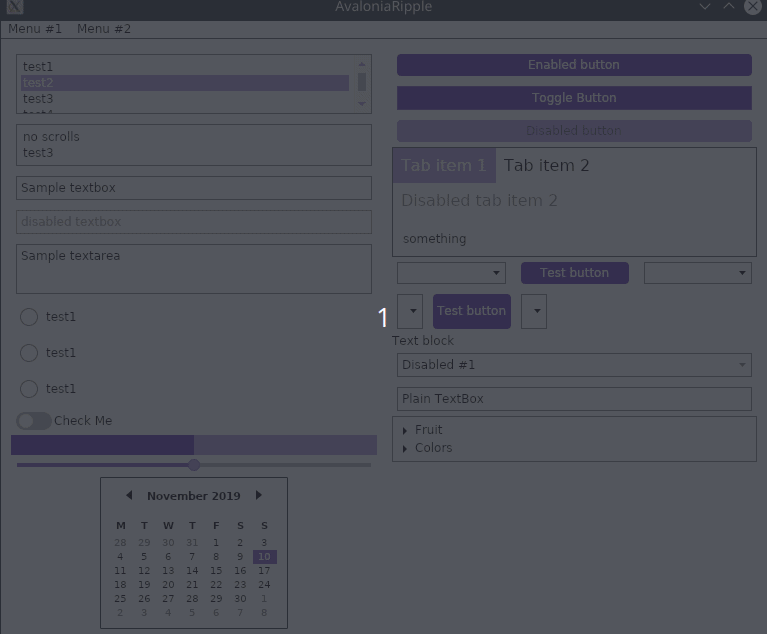
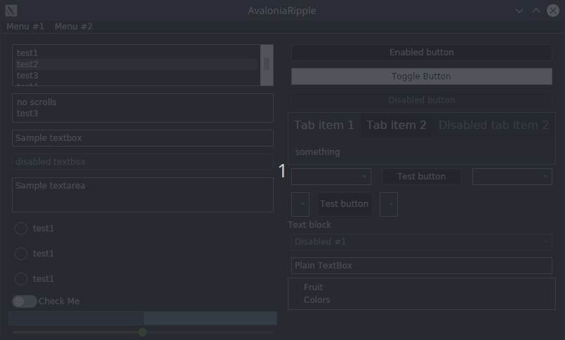

# material.avalonia
This repository is a set of styles that will help you customize your application in an appropriate material design.


[](https://www.nuget.org/packages/Material.Avalonia/)

 

To inslall them u should dounload nuget package and include styles in needed scope
Here u cans see an exapmle with Application style scope
```xml
  <Application.Styles>        
        <StyleInclude Source="avares://Material.Avalonia/Material.Avalonia.Templates.xaml" />
        <StyleInclude Source="avares://Material.Avalonia/Material.Avalonia.{Palette}.xaml" />
    </Application.Styles

```
Now we have next pallets:

 LightGreen
 
 DeepPurple
 
 Dark
 
