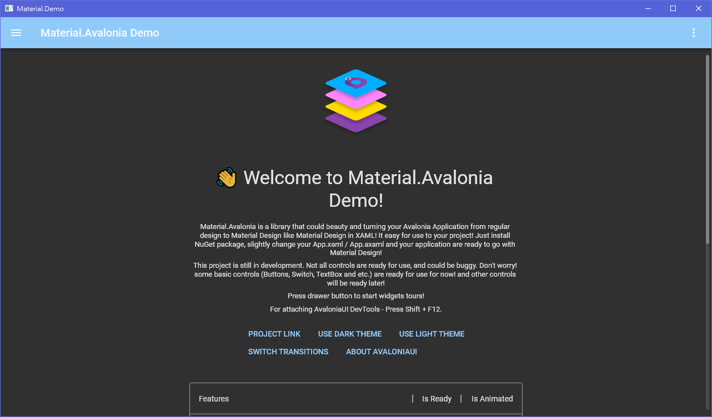

[nuget]: https://www.nuget.org/packages/Material.Avalonia/

#  Material.Avalonia

Customizable Material Design implementation for [AvaloniaUI](http://avaloniaui.net/) framework.


###### [More screenshots](https://github.com/AvaloniaUtils/material.avalonia/wiki/Screenshots-of-Demo)


#  Overview
This library is a collection of styles and controls to help you customize your Avalonia application with Material Design theme.
- Material Design styles for almost all Avalonia controls
- Additional controls to support the Snackbars, side sheets, floating buttons, cards, dialogs and more
- Easy configuration of palette (at design and runtime), according to Material Guidelines guidelines
- Full [Material Design Icons](https://materialdesignicons.com/) icon pack support (must be [installed separately](https://github.com/AvaloniaUtils/Material.Icons.Avalonia), in favor of small library size)
- Demo applications included in the source project

[][nuget]
[][nuget]
[][nuget]

#  Getting started
Check out the [getting started](https://github.com/AvaloniaCommunity/Material.Avalonia/wiki/Simple-getting-started) wiki page. Or follow these very quick instructions:
1. Add [Material.Avalonia][nuget] nuget package to your project:

       dotnet add package Material.Avalonia

2. Edit `App.xaml` file:

      ```xaml
      <Application ...
          xmlns:themes="clr-namespace:Material.Styles.Themes;assembly=Material.Styles"
          ...>
          <Application.Styles>
              <themes:MaterialTheme BaseTheme="Dark" PrimaryColor="Purple" SecondaryColor="Lime" />
          </Application.Styles>
      </Application>
      ```
- [Advanced theming](https://github.com/AvaloniaCommunity/Material.Avalonia/wiki/Advanced-Theming) wiki page
- [Nightly packages](https://github.com/AvaloniaCommunity/Material.Avalonia/wiki/Using-nightly-build-feed) wiki page
- [Material Design Icons](https://github.com/AvaloniaUtils/Material.Icons.Avalonia) icon pack support

### Powered by

<a href="https://www.jetbrains.com/?from=material.avalonia">

</a>
