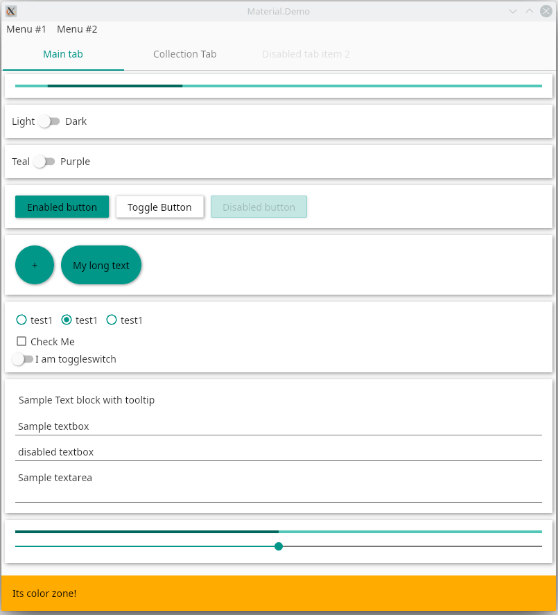

# material.avalonia



[](https://www.nuget.org/packages/Material.Avalonia/)

This repository is a collection of styles to help you customize your [Avalonia](https://github.com/AvaloniaUI/Avalonia) application theme with Material Design.

A collection of styles can be installed via [nuget-package](https://www.nuget.org/packages/Material.Avalonia/) and then include them to the required scope. See the example of `App.xaml` file:

```xaml
<Application ...
             xmlns:themes="clr-namespace:Material.Styles.Themes;assembly=Material.Styles"
             ...>
    <Application.Resources>
        <themes:BundledTheme BaseTheme="Light" PrimaryColor="Teal" SecondaryColor="Amber"/>
    </Application.Resources>
    <Application.Styles>
        <StyleInclude Source="avares://Material.Avalonia/Material.Avalonia.Templates.xaml" />
    </Application.Styles>
</Application>
```

You can configure starting color palette by modifying `BundledTheme`. We have all material design swatches support.
 Moreover, you can completely customize your colors and switch color palette at runtime via `PaletteHelper` class.

Not all controls are already styled, if some are not showing add the following lines to `Application.Styles` **before** previous. You should end up with something similar to:
```xaml
    <Application.Styles>
        <StyleInclude Source="avares://Avalonia.Themes.Default/DefaultTheme.xaml"/>
        <StyleInclude Source="avares://Avalonia.Themes.Default/Accents/BaseLight.xaml"/>
        <StyleInclude Source="avares://Material.Avalonia/Material.Avalonia.Templates.xaml" />
    </Application.Styles>
```

**Powered by**


<a href="https://www.jetbrains.com/?from=ABC">

</a>
